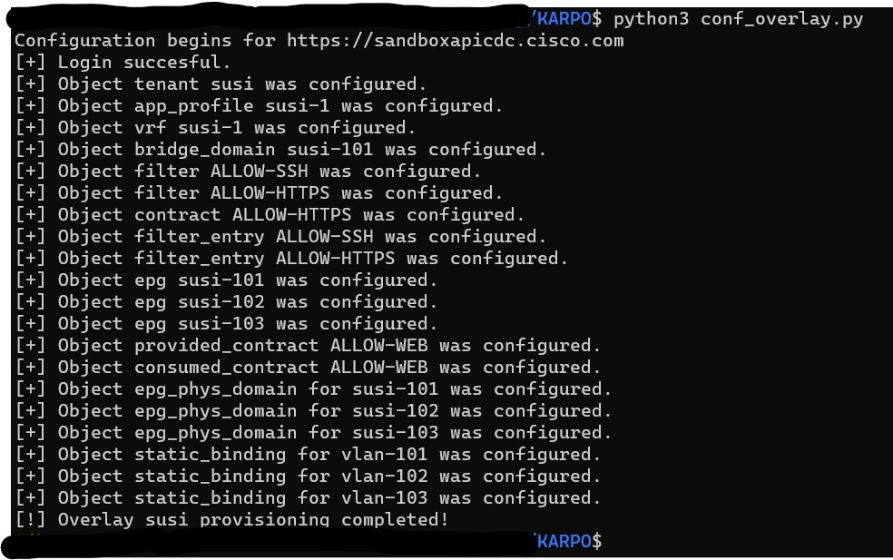

# Configure ACI with Python!

## Functionality
- Python script repository for simple Cisco ACI automation tasks.
- At this point concentrates on provisioning and "pushing" Tenants configurations.
- createOverlay.py is the main script at the moment. It creates a new overlay network and policies attached to that based on configuration database maintained in configuration.json.
- payloads folder contain the Jinja2 templates that are used to render payloads for the REST calls that are sent to APIC.
- all payloads are supported and POST'ed by default.

## Example

## Next steps
- Please note this repository is very much under development - sporadically. 
- Add fabric access policies
